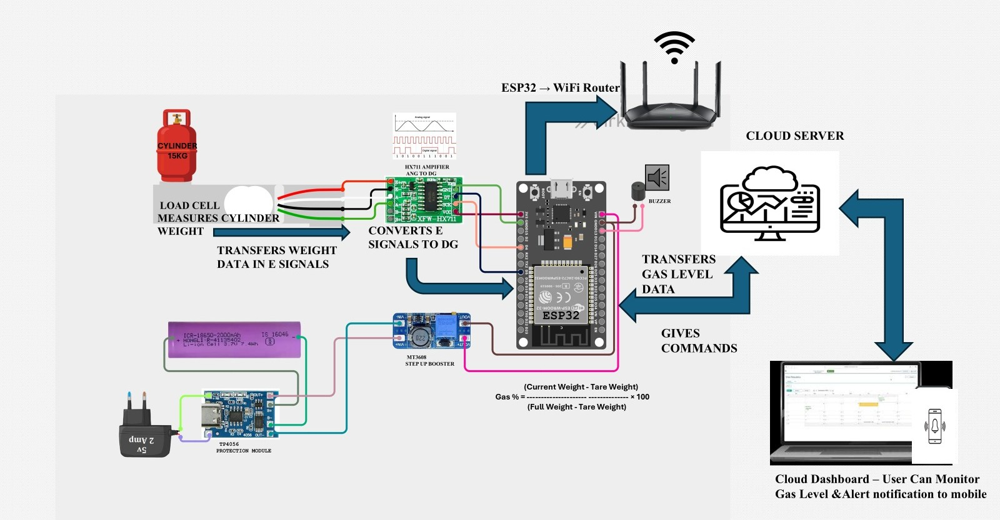
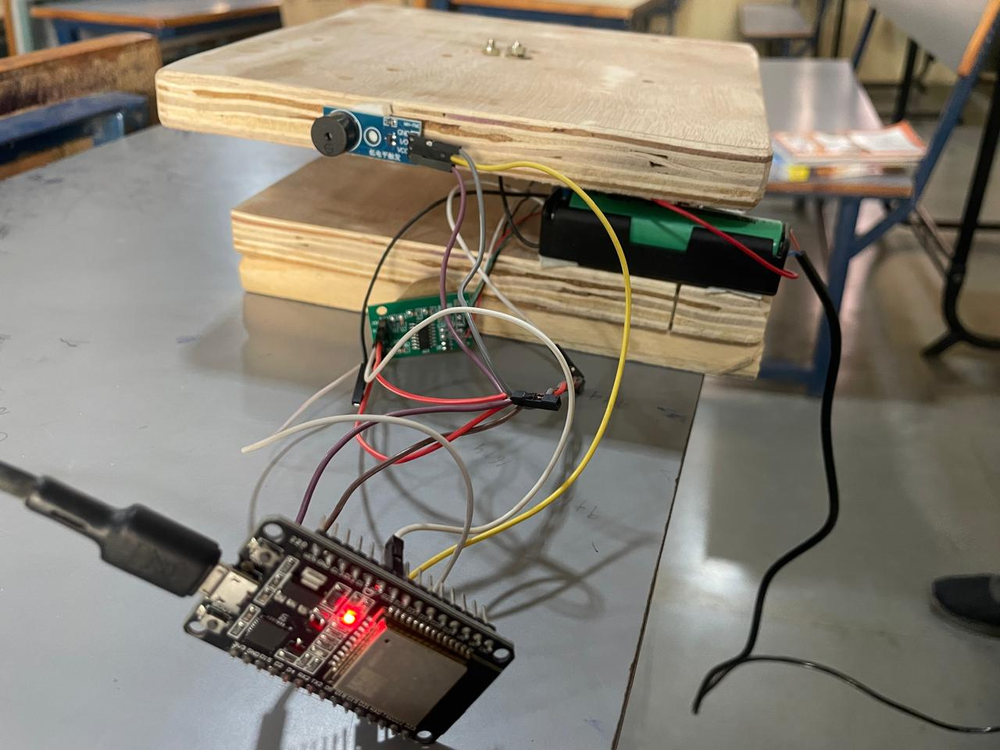
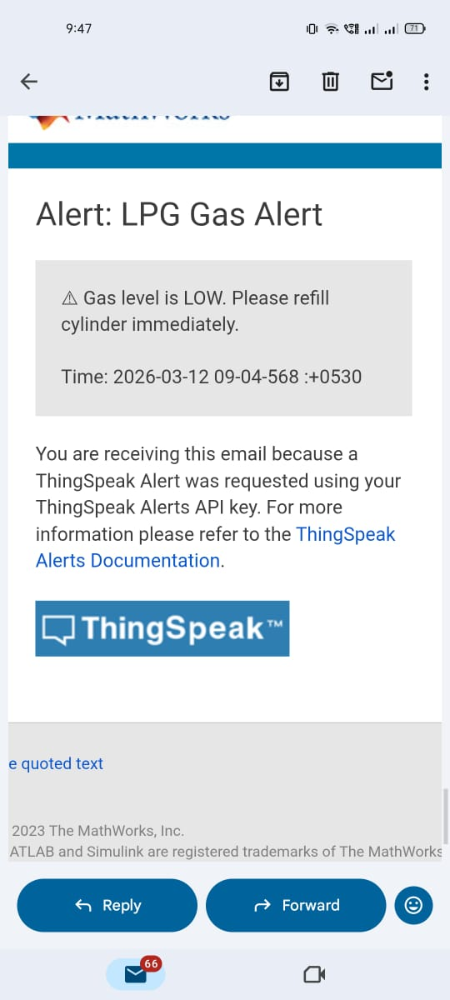

# Smart LPG Gas Cylinder Monitoring & Booking Alert System

An IoT-based real-time LPG monitoring system designed to continuously measure cylinder weight, estimate remaining gas percentage, detect abnormal weight drops, and generate automatic low-gas alerts using cloud integration.

The system integrates ESP32, HX711 load cell amplifier, and ThingSpeak cloud platform for remote monitoring and smart household energy management.

---

## Overview

This project monitors LPG cylinder weight using a load cell and HX711 amplifier. The ESP32 processes the sensor data, calculates the remaining gas percentage, and uploads the data to the ThingSpeak cloud platform. When the gas level falls below a predefined threshold, an automatic email alert is triggered along with a local buzzer notification.

---

## Features

- Real-time LPG cylinder weight monitoring  
- Gas percentage calculation  
- Automatic low-gas alert via ThingSpeak  
- Cloud dashboard visualization  
- WiFi-enabled ESP32 communication  
- Abnormal weight drop detection  
- Local buzzer notification  

---

## Hardware Components

- ESP32 Dev Module  
- HX711 Load Cell Amplifier  
- 20kg Load Cell  
- 18650 Li-ion Battery  
- MT3608 Step-Up Boost Converter  
- TP4056 Charging Module  
- Buzzer  
- Wooden platform structure  

---

## Software and Cloud Technologies

- Arduino IDE  
- Embedded C++  
- ESP32 WiFi Library  
- ThingSpeak Cloud Platform  

---

## System Design

<p align="center">
  
</p>

---

## Hardware Setup

<p align="center">
  
</p>

---

## Alert Notification

<p align="center">
  
</p>

---

## Gas Percentage Calculation

Gas % = (Current Weight - Tare Weight) / (Full Weight - Tare Weight) × 100

This formula calculates the remaining LPG percentage based on real-time weight readings.

---

## Working Principle

1. The load cell measures the LPG cylinder weight.  
2. HX711 converts analog signals into digital data.  
3. ESP32 reads and processes the weight values.  
4. The system calculates gas percentage using calibration data.  
5. Data is transmitted to ThingSpeak via WiFi.  
6. If gas level falls below the threshold:
   - Email alert is triggered.
   - Buzzer provides local notification.
7. User monitors data through the cloud dashboard.

---

## Project Structure

smart-gas-cylinder-monitoring/
│
├── smart_gas_monitor.ino  
├── README.md  
└── images/  
    ├── system_design.jpeg  
    ├── hardware_setup.jpeg  
    └── lpg_alert.jpeg  

---

## Security Notice

WiFi credentials and API keys have been removed from the public repository for security purposes.

Replace the placeholders in the code before running:

```cpp
const char* ssid = "YOUR_WIFI";
const char* password = "YOUR_PASSWORD";
const char* writeAPIKey = "YOUR_API_KEY";
